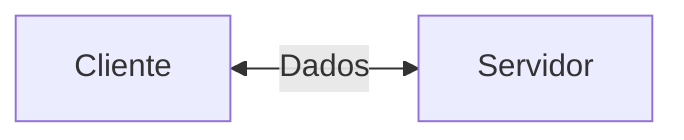
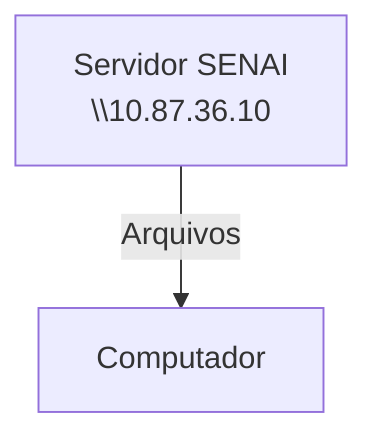
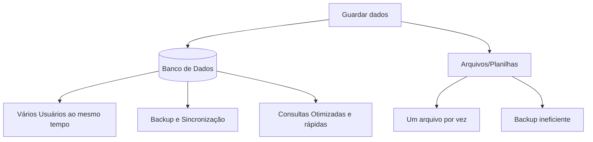

## Configuração do Servidor Educacional


---
**Objetivo**:
- Experiência real de mercado;
- Administração de recursos;
- Experiência de servidores Linux.

### Servidor de arquivos
Servidor educacional para arquivos, assim não dependendo de redes externas.


---
## Servidor de Desenvolvimento
Cada aluno recebe seu próprio acesso e cada PC recebe um IP diferente 

>192.168.10.24

|Recurso|Configuração|
|-------|------------|
|CPU| 2 cores|
|RAM| 512 MB|
|DISCO| 6 GB|
|SISTEMA OPERACIONAL| Ubuntu 26.04 LTS|
|ACESSO| SSH (Secure Shell)|

Dados de acesso:
|Campo|Valor|
|---|----|
|IP do Container|192.168.10.39|
|Usuário|Root|
|Senha Inicial|aluno01|

Comando para vizualizar uso de recursos
```bash
htop
```
Comando para alterar senha:
```bash
passwd
```

---

## Banco de Dados
Dados:

isolados não dizem muita coisa. 

EXEMPLO: 
- Platini, 
- Futebol, 
- Chuteira.

Informação:

 O Platini vai jogar futebol com a I1D35. 😊🤣

 ```mermaid
 graph LR
 A[Dado: Chuteira] --> B[Processamento] --> C[Informação: O cliente precisa de uma chuteira]
 ```
 ---
 Funcionamento do Youtube (Exemplo):
 ```mermaid
 graph LR
 A[Usuário] --> B[Aplicação/Youtube] --> C[(Banco de Dados)] --> D[Video/Pesquisa] --> A[Usuário]
 ```

 ---
 >Por qual razão, as empresas não salvam os dados em arquivos comuns?


---
## SGBD
Sistema Gerenciador de Banco de dados.
>POSTGRESQL: SGBD OpenSource e muito completo
Primeiro, começamos atualizando os pacotes:
```bash
sudo apt update && upgrade
```

