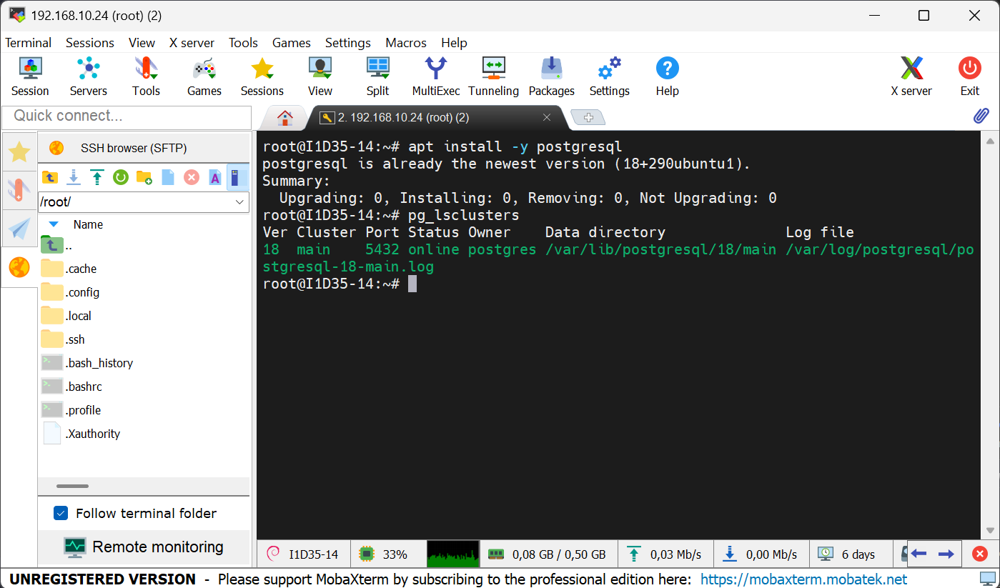
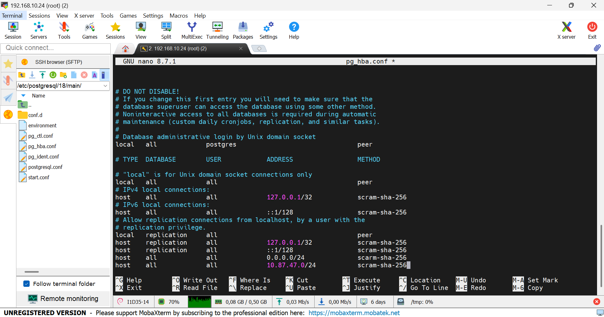

## Aula 02

para verificar as informações do banco de dados, utilizando o comando:

```bash
pg_lsclusters
```


---

para acesso, via root, sem senha (SOCKET LOCAL), utilizamos o comando:

```bash
sudo -u postgres psql
```

>Com esse comand, não preciso mostrar quem o meu usuário é, o Linux já faz a autenticação

>`\q` retorna ao usuário anterior (\quit).

para alteração de usuário postgres, utilizamos o comando:

```sql
ALTER USER postgres PASSWORD '1234';
```

Após alteração da senha, o acesso, via localhost (Socket Externo), é feito através do comando:

```bash
sudo psql -h 127.0.0.1 -U postgres
```

Configurações iniciais do POSTGRES:
- Para habilitar conexões externas, de outros IP's, foi necessário as seguintes etapas:
1. Navegar até a pasta do POSTGRES (`/etc/postgres/18/mais/`).
2. Editar o arquivo `postgresql.conf`através do comando:

```bash
sudo nano postgresql.conf
```
3. Editar a linha listen_adresses = '*'

4. Editar o arquivo pg_hba.conf.

5. Nas últimas linhas adicionamos as seguintes configurações:

`host all all 0.0.0.0/24 scram-sha-256`

`host all all 10.87.47.0/24 scram-sha-256`



**Criação do primeito Banco de Dados**


Para criar o Banco de Dados, utilizamos o comando:

```sql
CREATE DATABASE cidades;
```
Para verificar os Bancos existentes:

```sql
\l
```