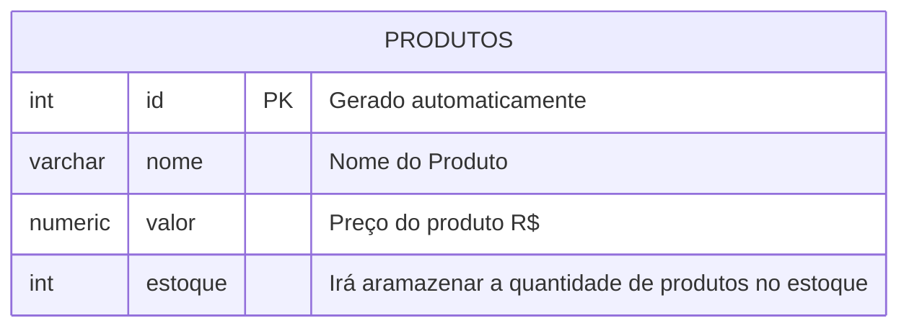

##
para apagar um banco de dados, utilizamos o comando:

```sql
DROP DATABASE cidades;
```

> NUNCA ESQUECER DO PONTO E VIRGULA ( ; )

---

**Modelagem do Banco de Dados**



Após modelar, iremos executar as etapas de criação e inserção de dados. 
---
Para criar a tabela, usamos os comandos:
```sql
CREATE TABLE produtos(
    id INT GENERATED ALWAYS AS IDENTITY PRIMARY KEY,
    nome VARCHAR(100) NOT NULL,    
    valor NUMERIC(10,2) NOT NULL,
    estoque INT NOT NULL DEFAULT 0
-- );
```

---
Para consultar dados da tabela usamos o comando:
```sql
SELECT * FROM produtos;
```

para rodar ou usar:
**F5* ou **fn F5**

para inserir dados na tabela usamos o comando:
```sql
INSERT INT produtos(nome,valor,estoque)
VALUES('Caneta','1.50','100');
SELECT * FROM produtos;
```
