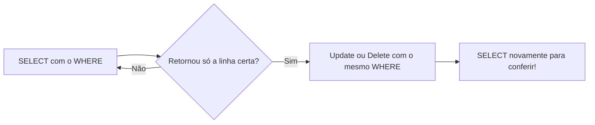

## UPDATE E DELETE
O comando UPDATE e DELETE atinge todas as linhas. Logo, não pode ser realizado sem `WHERE`!
Fluxo, sempre:



---
Executando o comando **UPDATE**:
```sql
UPDATE produtos
SET valor = 5
WHERE id=1;
``` 

---
Executando o comando **DELETE**:
```sql
UPDATE produtos 
SET valor = 10
WHERE id = 2;
```
---
Cuidado! Não existe `CTRL+Z` caso você apague ou atualize tudo! 